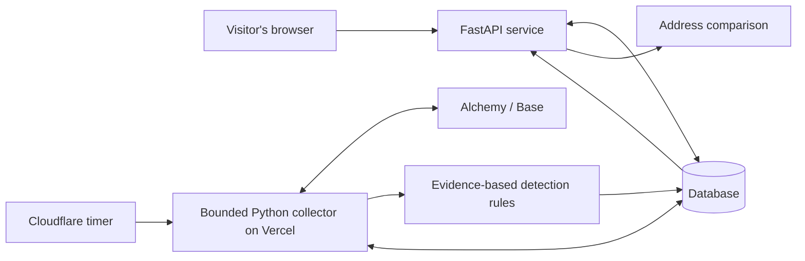

# Semblance: system design

Release and deployment verification are tracked in RELEASE.md. This document describes implementation behavior; detection results (100% across the evaluated real-Base cases) are in evaluation/README.md.

## Product and boundary

Semblance helps people inspect Base wallet activity, check a recipient before sending, and understand warning evidence. It never signs transactions, holds keys, executes revocations, or promises that an address is safe. The two initial rules are lookalike-address detection and unlimited ERC-20 token permissions. Broader scam detection, NFTs, contracts auditing, and fund recovery are outside this release.

## The five pieces, in plain language

1. **Website (React + TypeScript):** the screen people use. It sends requests to our service and displays findings. It does not receive provider secrets.
2. **API (FastAPI/Python):** the reception desk. An API is an agreed way for programs to ask each other for information. This validates addresses, saves watchlists, performs recipient comparisons, and returns alerts.
3. **Worker (Python):** the night watch. A Cloudflare timer calls a secret-protected Vercel endpoint every five minutes. The endpoint runs a bounded collection pass even when every browser is closed. Locally, the same collector can run as a separate process. It remembers the last processed block, retries transient failures, and exposes stale/error status.
4. **Database (PostgreSQL in deployment, SQLite for local development):** the filing cabinet. It stores browser sessions, watched addresses, user-marked trusted contacts, observed activity, alerts, and monitoring progress. SQLite is a local database file; PostgreSQL is a shared database service used by the API and worker.
5. **Data provider (Alchemy on Base):** the window into the blockchain. Indexed transfer history and contract event logs are separate data feeds. A provider key authorizes paid/free usage, not access to anyone's funds.

## User journeys

- **Explore:** enter example mode without an account or wallet connection. Examples use explicitly simulated data and never link invented transaction hashes to a real explorer.
- **Check before sending:** paste a destination, select a monitored wallet or provide a reference address. Compare full normalized addresses with prior outgoing recipients and explicitly trusted contacts. Show exact matches separately from lookalikes. Mark history coverage and data age. A prior recipient is not automatically trusted. With no references, return insufficient context, not a clean verdict.
- **Watch:** add a public address with an optional label. One anonymous, unguessable browser session owns its private watchlist and labels. Closing the browser does not stop the separate worker. Clearing its cookie loses access to that session's private list; there is no cross-device login in this release. Expired sessions are cleaned up by the worker.
- **Understand:** open an alert to see its rule, evidence, timestamp, contract and transaction identifiers, review action, and acknowledgment control. No alert is labeled a confirmed crime. Acknowledgment hides attention demand without changing the evidence.
- **Replay:** inspect a simulated sequence one event at a time, including the legitimate recipient, lookalike contact, and oversized approval. This is an explanatory demo, not proof of live detection performance.

## Data collection and coverage

Initial history: fetch bounded paginated external/native and ERC-20 transfers in both directions. Preserve page-limit truncation as visible partial coverage. ERC-20 means the common interchangeable-token contract interface. Exclude NFTs and internal contract movements in this first release and say so in the product.

Approval coverage starts when a watch is registered, with a small recent overlap. Do not imply that recent approval events enumerate all existing permissions. Approval logs are queried in ranges of at most 10 blocks for Alchemy free-tier compatibility. Read current `allowance(owner, spender)` at the processed block for a reported unlimited grant. Malicious contracts can fabricate events and even return misleading values: frame this as a contract-reported permission and preserve the token contract identity, never as verified legitimacy or theft.

Use Base's `safe` block head rather than the newest unconfirmed head. This reduces reorganization risk and increases delay; no 30-second promise is made. Save block number and hash. Before advancing a saved cursor, verify the saved block hash and verify the collection endpoint hash both before and after reads; on a mismatch purge and rebuild that wallet's observed window. This is a conservative recovery, with catch-up status visible.

Read the next bounded block range, get transfers and approvals, evaluate, and commit observations plus cursor atomically (all succeed together). Failed/partial collection must not advance the cursor. Deduplicate transfer provider IDs and log transaction-hash/log-index identities. On provider failure return a fixed sanitized message and retain the previous evidence with stale status. Never expose a secret-bearing provider URL in errors.

Default limits: 3 watches per browser, 3 unique wallets globally for the free pilot, 300-second target interval, up to 300 blocks per scan per wallet, 3 history pages per direction. Retain at most 10,000 transfers and 1,000 alerts per wallet; mark history partial when truncated. Each hosted pass has a 45-second budget divided among wallets so one slow wallet cannot starve the rest. These are configurable cost/abuse limits, not scale claims. An outage can produce a backlog; show the last checked time and catch-up state. Real data usage must be measured before changing limits. Only free plans are authorized. Service quotas can pause operation; these are not unlimited-capacity or uptime guarantees. At a steady two-second block interval, three wallets checked every five minutes use roughly 29.5 million Alchemy compute units per 30 days before history loads/retries; this is a planning estimate, not measured usage. Reduce capacity/cadence or batch owner-log queries before quota pressure. Neon compute quotas also need monitoring; free hosting is a bounded pilot.

Direct-token proof enrichment is optional and bounded separately: at most 12 candidate records per wallet pass, four concurrent verification jobs, and a three-second total enrichment budget. Newer candidates are checked first. Completed proof outcomes persist; unavailable or unfinished checks remain retryable. A proof backlog does not block ordinary collection, but can delay token-derived references and their warnings. The usage estimate above excludes these extra transaction/receipt reads.

Existing stored transfers are enriched in place without resetting the cursor or requiring a database-column migration. When a token recipient is newly verified, retained incoming and outgoing zero-value events are checked against that recipient within the wallet's monitoring coverage. Previously collected outgoing zero-value events also receive a full review against existing references, capped at 100 old events per wallet pass; `lookalike_review_version: 2` records that review. These rechecks still require the reference to precede the event and retain alert deduplication. They cannot recover activity already pruned by the 10,000-transfer retention limit or before monitoring coverage began.

## Detection semantics

**Lookalike:** normalize the 20-byte address, validate mixed-case checksums, exclude exact matches. Flag a distinct address sharing at least 4 leading and 4 trailing hex characters with a reference, or differing in at most 2 positions. This is a transparent heuristic (a defined approximation), not a trained model. Case differences alone do not create warnings. Highlight differing character positions. The recipient-check tool uses explicit references, user-marked contacts, and prior positive native or verified direct-token payments. Monitoring uses those prior payment relationships, never arbitrary inbound addresses.

**Direct-token reference proof:** require a positive outgoing ERC-20 record and independently fetch its transaction and receipt. The transaction sender must be the watched wallet, its destination must be the same token contract, and its calldata (encoded call instructions) must be exactly a canonical `transfer(address,uint256)` call with the recorded recipient and positive raw amount. A successful receipt must contain an unremoved Transfer event from that token with the same sender, recipient, and amount. Transaction hashes, block numbers, and block hashes must agree across the transaction, receipt, and event. Missing or inconsistent evidence cannot establish a reference. Routed transfers and smart-wallet token calls are intentionally excluded, as their recipient intent needs different verification. A token label or a token-generated event alone is never proof, and a verified relationship never certifies a recipient as safe.

**Monitoring candidates:** check the sender of incoming native/token transfers and the recipient of outgoing zero-value ERC-20 events. For either direction, require the reference payment to occur in an earlier block; same-block references are excluded to avoid inventing transaction order. Outgoing token events can be fabricated or triggered by another party, so their warnings explicitly say that the event does not prove the wallet owner initiated a payment. The alert retains its direction, token contract, event value, reference kind, and reference block. A reference index narrows comparisons without changing the lookalike rule.

**Unlimited approval:** identify the exact maximum unsigned 256-bit allowance in a standard ERC-20 Approval event, re-read the allowance at that block, and create a review warning for the observed maximum event, distinguishing a confirmed maximum, a subsequently reduced allowance at block end, and an unavailable read. If the call fails, mark the observation unverified rather than silently reporting nothing. A subsequent zero/limited allowance is a different event; alerts retain the time-qualified evidence and are not presented as a complete current-permission inventory. Labels from token data are untrusted strings, rendered as text.

## Session and deployment security

The API issues a random browser session identifier in a signed HttpOnly cookie (JavaScript cannot read it). Production requires a strong session secret, secure cookies over HTTPS (encrypted web connections), a configured site origin, and PostgreSQL. Enforce origin checks for browser mutations, resource ownership on every operation, address and request-size limits, and per-client rate limits. Hosted collectors use a PostgreSQL transaction-scoped advisory lock, compatible with Neon transaction pooling, to prevent overlapping collection passes. A separate shared lock protects monitor registration, deletion and orphan cleanup. The in-memory request limiter is per process; broader public rollout needs a durable shared limiter, identity and stronger abuse controls.

There is no user email/password database and no wallet signing prompt. Trusted contacts are session-specific; calling an address trusted records the user's choice, not our certification. Store provider credentials only in environment secrets on the server. Public code and anonymous on-chain data do not make watchlist labels public.

Vercel builds React static files and hosts FastAPI under one origin. Neon provides persistent PostgreSQL. Cloudflare Workers Free supplies only the timer, while Python performs collection within the Vercel function duration limit. This replaces the initial container/always-on-host plan to honor the free-only budget. GitHub stores source and runs tests, never production monitoring. The verified free hostname is https://semblance-omega.vercel.app; no domain purchase is needed.

## Verification and release gates

- Unit tests: invalid/mixed-case addresses, exact matches, lookalikes, insufficient history, no hindsight, unlimited/limited/revoked grants.
- Provider tests: pagination, HTTP and JSON-RPC errors, malformed responses, 10-block ranges, failed allowance reads, secret redaction, direct-token transaction/receipt/event agreement and forged-reference rejection.
- API tests: cookie tampering, session isolation, trusted-contact deletion, bounds, disallowed origins, unavailable provider, demo/live separation.
- Worker tests: duplicated polls, partial failure without cursor advancement, restart from cursor, block-hash mismatch recovery, stale state, delayed token-proof rechecks and bounded review of previously stored zero-value events.
- Browser tests: example replay, destination mismatch display, add/remove a watch, empty/error state, responsive layout.
- Deployment gates: real keyed Alchemy read; deployed database migration; one real worker cycle; restart persistence; HTTPS cookie round trip; host/provider spending limits agreed. Local tests do not satisfy these gates.

## Access needed

Already authorized: local repository, code, dependencies, tests, docs and local preview. GitHub CLI and Vercel identity checks passed on 2026-09-27; Composio GitHub was not connected.

Required services: Vercel Hobby, Neon Free, an Alchemy Free app with Base Mainnet enabled, and Cloudflare Workers Free for its scheduled trigger. Provisioning and release verification are recorded in RELEASE.md. No recurring charges are authorized. Secrets go into host settings or ignored local files. No wallet/private key is needed.

## Primary implementation references

- https://www.alchemy.com/docs/data/transfers-api/transfers-endpoints/alchemy-get-asset-transfers
- https://www.alchemy.com/docs/chains/base/base-api-endpoints/eth-get-logs
- https://eips.ethereum.org/EIPS/eip-20
- https://docs.base.org/base-chain/specs/protocol/consensus/derivation
- https://fastapi.tiangolo.com/tutorial/background-tasks/
- https://docs.sqlalchemy.org/en/20/

- https://vercel.com/docs/frameworks/backend/fastapi
- https://vercel.com/marketplace/neon
- https://developers.cloudflare.com/workers/configuration/cron-triggers/
