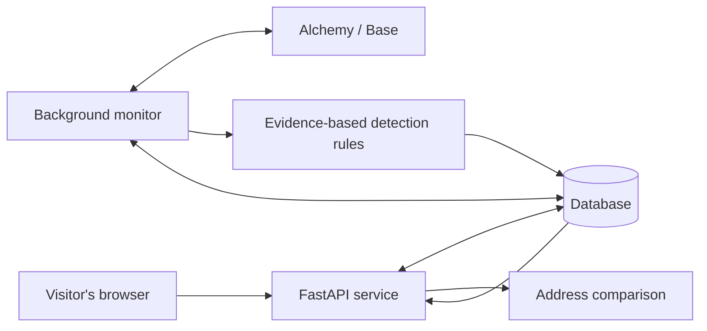

# Semblance: system design

Status: agreed product direction, implementation in progress. Numbers from early resume drafts are not performance claims.

## Product and boundary

Semblance helps people inspect Base wallet activity, check a recipient before sending, and understand warning evidence. It never signs transactions, holds keys, executes revocations, or promises that an address is safe. Ilan's Coinbase referral is the recruiting context, not a Coinbase endorsement. The two initial rules are lookalike-address detection and unlimited ERC-20 token permissions. Broader scam detection, NFTs, contracts auditing, and fund recovery are outside this release.

## The five pieces, in plain language

1. **Website (React + TypeScript):** the screen people use. It sends requests to our service and displays findings. It does not receive provider secrets.
2. **API (FastAPI/Python):** the reception desk. An API is an agreed way for programs to ask each other for information. This validates addresses, saves watchlists, performs recipient comparisons, and returns alerts.
3. **Worker (Python):** the night watch. This separate process checks watched wallets even when every browser is closed. It remembers the last processed block, retries transient failures, and exposes stale/error status.
4. **Database (PostgreSQL in deployment, SQLite for local development):** the filing cabinet. It stores browser sessions, watched addresses, user-marked trusted contacts, observed activity, alerts, and monitoring progress. SQLite is a local database file; PostgreSQL is a shared database service used by the API and worker.
5. **Data provider (Alchemy on Base):** the window into the blockchain. Indexed transfer history and contract event logs are separate data feeds. A provider key authorizes paid/free usage, not access to anyone's funds.

## User journeys

- **Explore:** enter example mode without an account or wallet connection. Examples use explicitly simulated data and never link invented transaction hashes to a real explorer.
- **Check before sending:** paste a destination, select a monitored wallet or provide a reference address. Compare full normalized addresses with prior outgoing recipients and explicitly trusted contacts. Show exact matches separately from lookalikes. Mark history coverage and data age. A prior recipient is not automatically trusted. With no references, return insufficient context, not a clean verdict.
- **Watch:** add a public address with an optional label. One anonymous, unguessable browser session owns its private watchlist and labels. Closing the browser does not stop the separate worker. Clearing its cookie loses access to that session's private list; there is no cross-device login in this release. Expired sessions are cleaned up by the worker.
- **Understand:** open an alert to see its rule, evidence, timestamp, contract and transaction identifiers, review action, and acknowledgment control. No alert is labeled a confirmed crime. Acknowledgment hides attention demand without changing the evidence.
- **Replay:** inspect a simulated sequence one event at a time, including the legitimate recipient, lookalike contact, and oversized approval. This is an explanatory demo, not proof of live detection performance.

## Data collection and coverage

Initial history: fetch bounded paginated external/native and ERC-20 transfers in both directions. Preserve page-limit truncation as visible partial coverage. ERC-20 means the common interchangeable-token contract interface. Exclude NFTs and internal contract movements in this first release and say so in the product.

Approval coverage starts when a watch is registered, with a small recent overlap. Do not imply that recent approval events enumerate all existing permissions. Approval logs are queried in ranges of at most 10 blocks for Alchemy free-tier compatibility. Read current `allowance(owner, spender)` at the processed block for a reported unlimited grant. Malicious contracts can fabricate events and even return misleading values: frame this as a contract-reported permission and preserve the token contract identity, never as verified legitimacy or theft.

Use Base's `safe` block head rather than the newest unconfirmed head. This reduces reorganization risk and increases delay; no 30-second promise is made. Save block number and hash. Before advancing a saved cursor, verify the saved block hash; on a mismatch purge and rebuild that wallet's observed window. This is a conservative recovery, with catch-up status visible.

Read the next bounded block range, get transfers and approvals, evaluate, and commit observations plus cursor atomically (all succeed together). Failed/partial collection must not advance the cursor. Deduplicate transfer provider IDs and log transaction-hash/log-index identities. On provider failure return a fixed sanitized message and retain the previous evidence with stale status. Never expose a secret-bearing provider URL in errors.

Default limits: 3 watches per browser, 5 unique wallets globally for the initial deployment, 60-second worker interval, 30 blocks per scan per wallet, 3 history pages per direction. These are configurable cost/abuse limits, not scale claims. An outage can produce a backlog; show the last checked time and catch-up state. Real data usage must be measured before changing limits. No claimed $0 always-on hosting budget.

## Detection semantics

**Lookalike:** normalize the 20-byte address, validate mixed-case checksums, exclude exact matches. Flag a distinct address sharing at least 4 leading and 4 trailing hex characters with a reference, or differing in at most 2 positions. This is a transparent heuristic (a defined approximation), not a trained model. Case differences alone do not create warnings. Highlight differing character positions. Use only user-marked contacts or previous outgoing recipients as references, never arbitrary inbound addresses. For monitoring, require a reference transaction earlier than the incoming event to avoid using future information.

**Unlimited approval:** identify the exact maximum unsigned 256-bit allowance in a standard ERC-20 Approval event, re-read the allowance at that block, and create an amber review warning when it remains maximum. If the call fails, mark the observation unverified rather than silently reporting nothing. A subsequent zero/limited allowance is a different event; alerts retain the time-qualified evidence and are not presented as a complete current-permission inventory. Labels from token data are untrusted strings, rendered as text.

## Session and deployment security

The API issues a random browser session identifier in a signed HttpOnly cookie (JavaScript cannot read it). Production requires a strong session secret, secure cookies over HTTPS (encrypted web connections), a configured site origin, and PostgreSQL. Enforce origin checks for browser mutations, resource ownership on every operation, address and request-size limits, and per-client rate limits. The initial API is one replica and the worker is one replica. Scaling requires shared rate limiting and a worker lease; do not launch multiple workers with this first design.

There is no user email/password database and no wallet signing prompt. Trusted contacts are session-specific; calling an address trusted records the user's choice, not our certification. Store provider credentials only in environment secrets on the server. Public code and anonymous on-chain data do not make watchlist labels public.

Build React to static files and serve from FastAPI in production for one origin. A container contains the app; run it once as the web service and once as the worker, both connected to PostgreSQL. GitHub stores source and runs tests. A free provider hostname is sufficient. Vercel can host a separate frontend, but is not the chosen host for an indefinite worker process; using it here would add cross-origin/session configuration without removing the worker host.

## Verification and release gates

- Unit tests: invalid/mixed-case addresses, exact matches, lookalikes, insufficient history, no hindsight, unlimited/limited/revoked grants.
- Provider tests: pagination, HTTP and JSON-RPC errors, malformed responses, 10-block ranges, failed allowance reads, secret redaction.
- API tests: cookie tampering, session isolation, trusted-contact deletion, bounds, disallowed origins, unavailable provider, demo/live separation.
- Worker tests: duplicated polls, partial failure without cursor advancement, restart from cursor, block-hash mismatch recovery, stale state.
- Browser tests: example replay, destination mismatch display, add/remove a watch, empty/error state, responsive layout.
- Deployment gates: real keyed Alchemy read; deployed database migration; one real worker cycle; restart persistence; HTTPS cookie round trip; host/provider spending limits agreed. Local tests do not satisfy these gates.

## Access needed

Already authorized: local repository, code, dependencies, tests, docs and local preview. GitHub CLI and Vercel identity checks passed on 2026-09-27; Composio GitHub was not connected.

Needed for real public monitoring: an Alchemy Base app key, a host capable of running an always-on web service and worker, a PostgreSQL database, and agreement to any recurring charges. Secrets go into host environment settings or the ignored local `.env`, never chat or Git. A custom domain is optional. No wallet/private key is needed.

## Primary implementation references

- https://www.alchemy.com/docs/data/transfers-api/transfers-endpoints/alchemy-get-asset-transfers
- https://www.alchemy.com/docs/chains/base/base-api-endpoints/eth-get-logs
- https://eips.ethereum.org/EIPS/eip-20
- https://docs.base.org/base-chain/specs/protocol/consensus/derivation
- https://fastapi.tiangolo.com/tutorial/background-tasks/
- https://docs.sqlalchemy.org/en/20/
