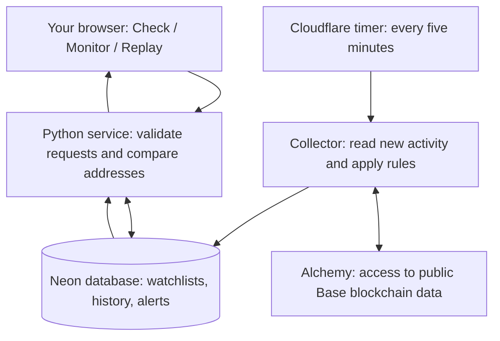

# Semblance, explained without a coding background

Semblance answers two questions: **“Does this recipient look like an impersonator?”** and **“What happened in this wallet that deserves a closer look?”** It watches public information. It never controls a wallet.

## What someone can do

1. **Check before sending.** Paste the destination and compare it with a known address, a saved contact, or prior payment recipients. Semblance highlights exactly which characters differ. It warns about lookalikes without treating an exact match as proof the recipient is safe.
2. **Monitor.** Add a public wallet address. Semblance looks for incoming lookalikes, misleading zero-value token entries that appear to go out of the wallet, and token permissions allowing unusually broad spending. Every warning has evidence and a suggested next action.
3. **Replay.** Step through a simulated incident showing how the pattern develops. Recruiters can inspect the product without owning crypto or connecting a wallet.

## How the pieces fit together

Think of a small security desk with a screen, an analyst, a filing cabinet and a scheduled patrol.

**The website** is built with React (a library for interactive screens) and TypeScript (JavaScript with checks that catch inconsistent data types). It draws the forms, highlighted addresses, history and replay. Vercel hosts it at a free web address.

**The service** is written in Python using FastAPI (a framework for accepting structured requests from the website). Its API (the agreed request-and-response interface) validates what the visitor enters, controls access to that visitor's saved list, performs comparisons and returns the evidence.

**The database** is PostgreSQL (a structured storage system) hosted by Neon. It remembers contacts, watchlists, observed transfers, alerts and the last processed block. A block is a numbered batch of blockchain activity. A cursor is the bookmark saying where collection stopped.

**The collector** is the background patrol. A Cloudflare cron trigger (a scheduled timer) wakes it even if nobody has the website open. It reads the next range, runs the rules and saves the findings. It saves its bookmark only if the whole range succeeded. If a provider fails, it keeps the old findings and shows a failure or stale status, rather than implying the wallet is clear.

**Alchemy** supplies access to Base's public data. Base is an Ethereum layer-2 network (a network that executes transactions while relying on Ethereum for settlement). We use indexed transfer history and separate approval-event queries; one feed does not provide everything.

## What detection actually means

**Lookalike addresses:** an attacker may use an address with the same beginning and ending as someone you recognize. The rule compares the whole address and highlights differences. Recipient history includes earlier positive ETH payments and direct token payments that pass an extra check: the wallet's actual transaction instructions and successful transaction receipt must agree on the token, recipient, and amount. A token's claim that money moved is not enough. Payments through routing services or smart wallets are excluded from these token references.

**Misleading history entries:** a token can record a zero-value “outgoing transfer” without the wallet owner choosing to send anything. Semblance checks whether that listed recipient resembles someone previously paid and warns against copying it. The warning describes the evidence; it does not claim the owner made the payment or that resemblance proves an attack.

The extra token checks happen in small batches, so references and warnings can appear later. When a payment is verified later, Semblance rechecks relevant saved activity from the monitoring period. It also revisits older saved zero-value entries as the new rule is applied. It keeps at most 10,000 transfers per wallet; activity outside that saved window is not a complete history audit.

**Unlimited approvals:** a token approval gives a contract permission to spend that token from a wallet. Maximum approval can be intentional, but creates exposure worth reviewing. Semblance checks what the token contract reported at the observed block and shows whether that read confirmed maximum permission, a lower permission, or failed. It does not label every permission a scam or claim it is still active now.

The rules are deterministic (the same evidence produces the same result), so we can test and explain them. An AI model is not deciding whether a transaction is safe. Coding assistants help build the product; they are not required to run each check.

## Why the design is useful

- **Preventive:** the recipient comparison can warn before a user sends. It cannot intercept or block the actual transaction.
- **Explainable:** users can inspect the full address, transaction and token contract behind a warning.
- **Recoverable:** repeated reads do not create duplicate alerts, and changed blockchain snapshots are rejected or rebuilt.
- **Private by default:** each browser has its own saved list and contact labels. No password, wallet connection or signature is needed. Clearing the browser's session cookie loses access to that list.
- **Free pilot:** three unique monitored wallets across the installation, with checks targeted every five minutes. The website refreshes its stored results more often. Provider delays and free quotas can increase delay or pause service. Manual comparisons and replay do not require a blockchain read.

## What the first release does not claim

It is not a universal scam detector, a complete audit of every existing token permission, or a replacement for a wallet. It does not cover NFT permissions or internal contract movements. The replay is simulated. Passing tests establishes the tested behavior; the real-world check (100% accuracy across every evaluated real-Base case) is documented in the evaluation.

No domain purchase is necessary. A custom domain can be added later without changing this architecture.
